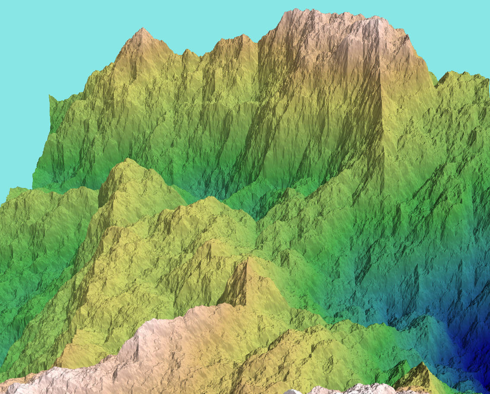

Python Fractal Mountain Landscape
---------------------------------

I watched the Nova documentary "Fractals - Hunting the Hidden Dimension" on Youtube, and was interested  in the story of a computer graphics engineer at Boeing, Loren Carpenter, who created the first computer-generated mountain landscapes. He did this after reading Benoit Mandelbrot's book about fractals, and created the landscapes by diving them into progressively smaller triangles. I tried out the idea with a small Python script.

To set up an easy coordinate system, I used squares split diagonally into right-angle triangles, which could be split into smaller
right-angle triangles with random elevations. That's somewhat imperfect but is enough to test the idea. I used the "Mayavi" Python library for 3D visualisation (since it was in the Ubuntu repository) to display the result.

All with just 20 lines of Python.

The image shown was generated with "random.seed(6)" added. Rotation, zoom and background colour were set interactively in the Mayavi visualizer.

The Python code was dashed out as a quick test, so the method of finding the correct corner points in the correct order is not very readable. Sorry about that. After writing this test, I Googled for the algorithms usually used in fractal landscape generation and found out about the fractal terrain "diamond square algorithm", so if you want to know more about this subject,
then I suggest you do the same.

